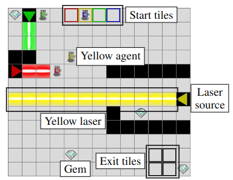

# Laser Learning Environment (LLE)
LLE is a fast Multi-Agent Reinforcement Learning environment written in Rust which has proven to be a difficult exploration benchmark so far. The agents start in the start tiles, must collect the gems and finish the game by reaching the exit tiles. There are five actions: North, South, East, West and Stay. 

When an agent enters a laser of its own colour, it blocks it. Otherwise, it dies and the game ends.



# Quick start
## Installation
You can install the Laser Learning Environment with pip or poetry.
```bash
pip install laser-learning-environment # Stable release with pip
pip install git+https://github.com/yamoling/lle # latest push on master
```

## Usage
LLE can be used at two levels of abstraction: as an `RLEnv` for cooperative multi-agent reinforcement learning or as a `World` for many other purposes.
### For cooperative multi-agent reinforcement learning
The `LLE` class inherits from the `RLEnv` class in the [rlenv](https://github.com/yamoling/rlenv) framework. Here is an example with the following map: 


```python
from lle import LLE

env = LLE.from_str("S0 G X").single_objective()
done = truncated = False
obs = env.reset()
while not (done or truncated):
    # env.render() # Uncomment to render
    actions = env.action_space.sample(env.available_actions())
    obs, reward, done, truncated, info = env.step(actions)
```


### For other purposes or fine grained control
The `World` class provides fine grained control on the environment by exposing the state of the world and the events that happen when the agents move.

```python
from lle import World, Action, EventType

world = World("S0 G X")  # Linear world with start S0, gem G and exit X
world.reset()
available_actions = world.available_actions()[0]  # [Action.STAY, Action.EAST]
events = world.step([Action.EAST])
assert events[0].event_type == EventType.GEM_COLLECTED
events = world.step([Action.EAST])
assert events[0].event_type == EventType.AGENT_EXIT
```

You can also access and force the state of the world
```python
state = world.get_state()
...
events = world.set_state(state)
```

You can query the world on the tiles with `world.start_pos`, `world.exit_pos`, `world.gem_pos`, ...


## Citing our work
The environment has been presented at [EWRL 2023](https://openreview.net/pdf?id=IPfdjr4rIs) and at [BNAIC 2023](https://bnaic2023.tudelft.nl/static/media/BNAICBENELEARN_2023_paper_124.c9f5d29e757e5ee27c44.pdf) where it received the best paper award.

```
@inproceedings{molinghen2023lle,
  title={Laser Learning Environment: A new environment for coordination-critical multi-agent tasks},
  author={Molinghen, Yannick and Avalos, Raphaël and Van Achter, Mark and Nowé, Ann and Lenaerts, Tom},
  year={2023},
  series={BeNeLux Artificial Intelligence Conference},
  booktitle={BNAIC 2023}
}
```

## Development
If you want to modify the environment, you can clone the repo, install the python dependencies then compile it with `maturin`. The below example assumes that you are using `uv` as package manager but it should work with `conda`, `poetry` or just `pip` as well.
```
git clone https://github.com/yamoling/lle
uv venv         # create a virtual environment
source .venv/bin/activate
uv sync         # install python dependencies
maturin dev     # build and install lle in the venv
```

You can also re-generate the python bindings in the folder `python/lle` with
```bash
cargo run --bin stub-gen
```


## Tests
This project **does not** respect Rust unit tests convention and takes inspiration from [this structure](http://xion.io/post/code/rust-unit-test-placement.html). Unit tests are in the `src/unit_tests` folder and are explicitely linked to in each file with the `#path` directive. 
Integration tests are written on the python side.

Run unit tests with 
```bash
cargo test
```

Run integration tests with
```bash
maturin develop
pytest
```
